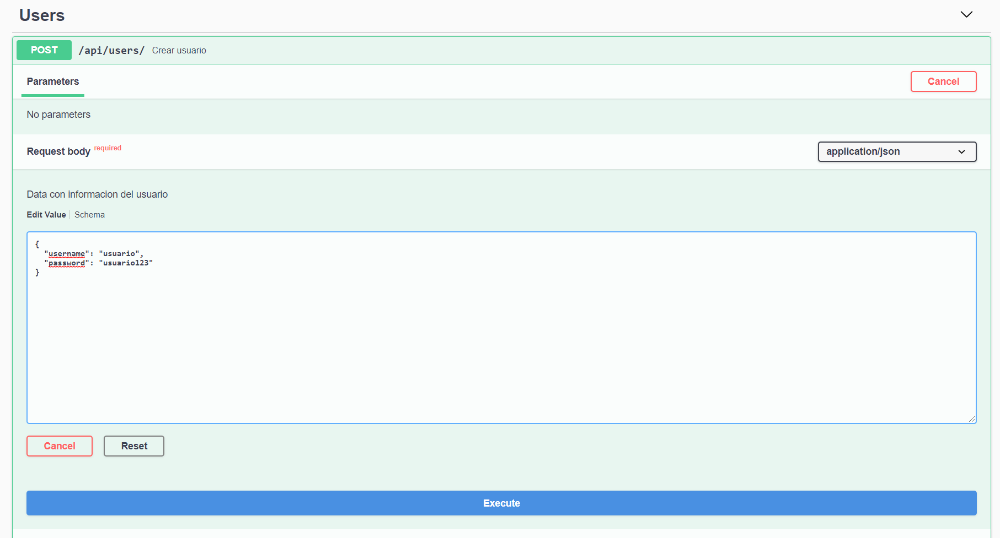
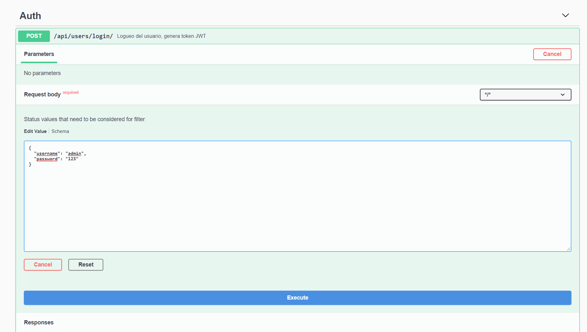
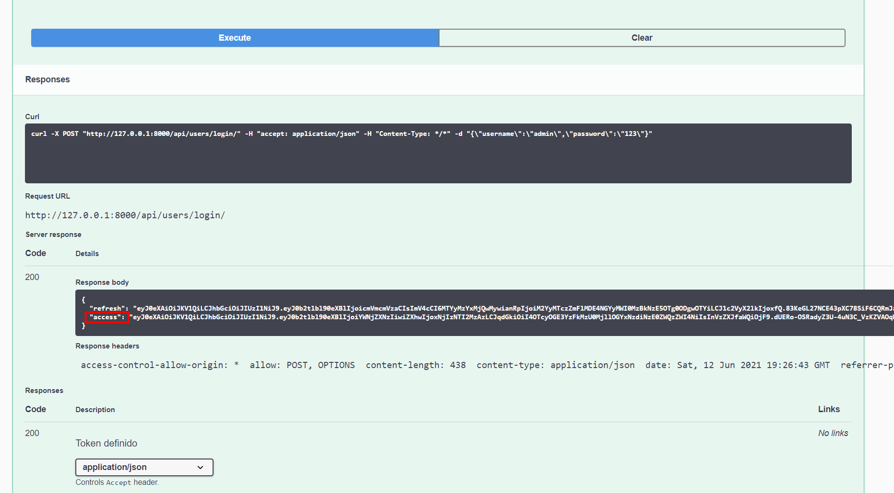
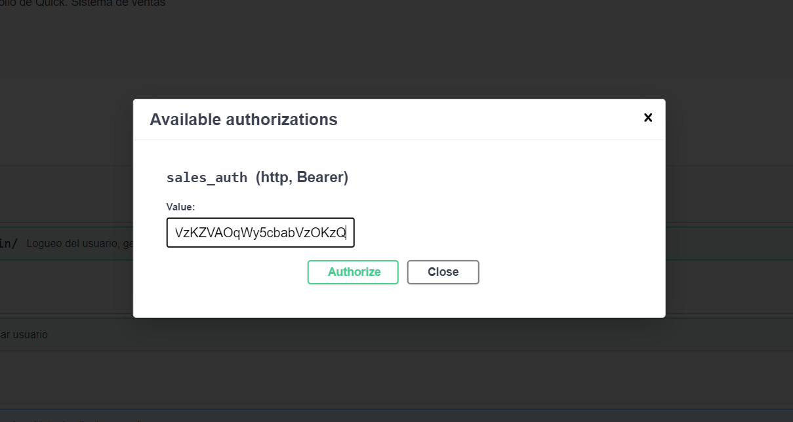
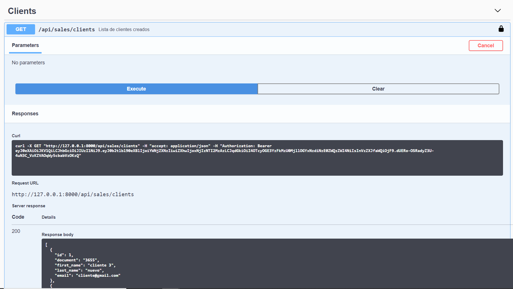

# Quick Sales

## Instrucciones de instalacion

1. Instalar liberias:
   
    `pip install -Ur requirements.txt`


2. Configuracion BD: En el archivo `salesproject/settings.py` 
modificar la configuracion de conexion con la base de datos
   
```python
DATABASES = {
    'default': {
        'ENGINE': 'django.db.backends.postgresql_psycopg2',
        'NAME': '[DATABASE_NAME]',
        'USER': '[USER_DATABASE]',
        'PASSWORD': '[PASSWORD]',
        'HOST': '[HOST]',
        'PORT': '[PORT]',
    }
}
```
3. Correr migraciones:
   
    `python manage.gy migrate`
   

4. Ejecutar la aplicacion:
    
    `python manage.py runserver`
    
    La aplicación correrá en http://127.0.0.1:8000/


## Documentacion y pruebas API

- La documentacion de todos los endpoints se puede encontrar
la siguente url: http://127.0.0.1:8000/api-doc/#/
  
### Pasos para la autenticacion y pruebas de la API
  
   1. Crear usuario utilizando el endpoint: `POST /api/users`
   
   

   2. Obtener el access token de un usuario utilizando el endpoint `POST /api/users/login/`
      
   

   3. Autorizar los request agregando el access token
   
   
   
   
   
   4. Probar los endpoints

   

    
    
